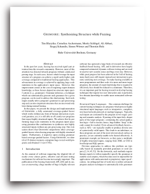

# Grimoire: Synthesizing Structure while Fuzzing
<a href="https://www.usenix.org/conference/usenixsecurity19/presentation/blazytko">  </a>

Grimoire is coverage-guided fuzzer for structured input languages. It is built upon [Redqueen](https://github.com/RUB-SysSec/redqueen).

 The fuzzer is based on our [paper](https://www.usenix.org/system/files/sec19-blazytko.pdf) ([slides](https://www.usenix.org/sites/default/files/conference/protected-files/sec19_slides_blazytko.pdf), [recording](https://www.youtube.com/watch?v=VF9YcAnzMPI)):

```
@inproceedings{blazytko2019grimoire,
    author = {Tim Blazytko and Cornelius Aschermann and Moritz Schl{\"o}gel and Ali Abbasi and Sergej Schumilo and Simon W{\"o}rner and Thorsten Holz},
    title =  {{GRIMOIRE}: Synthesizing Structure while Fuzzing},,
    year = {2019},
    booktitle = {USENIX Security Symposium} 
}
```

# Setup

1. Setup [Redqueen](https://github.com/RUB-SysSec/redqueen)
2. Apply Patch `qemu.patch` to `QEMU-PT`
3. Use this python code base instead of Redqueen's `kAFL-Fuzzer`
4. Create a string dictionary (for string mutations) via `strings -n3 -d <path to binary> | grep -v "\s" | sort | uniq > dict.txt`
5. Prepare binary and fuzz as described [here](https://github.com/RUB-SysSec/redqueen#initial-setup). To use the dictionary, add `-I <dict file>` to `kafl_fuzz.py`.


# Code

Grimoire can be understood as a patch applied to Redqueen's code base.  The published source code contains Redqueen's fuzzing logic, the implementation of
Grimoire as well as its interaction with Redqueen.

In detail, Grimoire's is organized as follows:

## Inference Logic

The inference logic (paper section 3.1) is contained in `fuzzer/technique/grimoire_inference.py`.

## Mutations

Grimoire's large-scale mutations (paper section 3.2)  are contained in `fuzzer/technique/grimoire_mutations.py`.

## Interaction with Redqueen

`fuzzer/scheduler.py` defines `GrimoireScheduler`, which is used in Redqueen's `InputQueue` in file `fuzzer/queue.py`. Everytime a `SlaveProcess` (`fuzzer/process/slave.py`) requests a new input from the queue, a non-generalized input that triggered new coverage will be returned.

This input is then generalized in the state `grimoire_inference` in `FuzzingStateLogic` (`fuzzer/state_logic.py`)


In a later fuzzing stage---during Redqueen's havoc mutation phase---Grimoire's mutations will be applied in `FuzzingStateLogic`.
